# Walkthrough - Blinding and Subjective Ratings Analysis

This walkthrough summarizes the findings from the statistical analysis of the CITRUS study participant blinding and questionnaire ratings (sensation, sound, tiredness).

---

## 1. Blinding Validation Results

The analysis demonstrates that **participant blinding was highly successful**.

```mermaid
gantt
    title Blinding Performance Summary
    dateFormat  X
    axisFormat %s
    section Metrics
    Guess Accuracy (60%) :active, 0, 60
    Chance Level (50%) :crit, 0, 50
    Bang's Blinding Index (0.20) :active, 0, 20
```



* **Guess Accuracy**: $3 / 5$ ($60.0\%$) correct guesses. 
* **Statistical Significance**: A two-sided **Binomial Test** confirms this accuracy is not significantly different from chance ($50\%$ guess rate), with a $p$-value of $1.0000$.
* **Bang's Blinding Index (BBI)**: $0.20$. A index score close to $0.0$ indicates that guess patterns represent random guessing, validating the efficacy of the randomized-phase defocused control condition (`CON`) as a robust blinding technique.

---

## 2. Subjective Sensation & Sound Levels

We compared subjective sound and physical skin sensation levels between the Focused (`EXP`) and Defocused (`CON`) sessions.

| Subjective Measure | EXP Mean | CON Mean | Wilcoxon $W$ | $p$-value |
| :--- | :---: | :---: | :---: | :---: |
| **Sound Level** | 2.60 | 1.80 | 3.5 | 0.3750 |
| **Skin Sensation** | 1.30 | 0.60 | 0.0 | 0.5000 |

* **Finding**: There are no statistically significant differences in perceived sound levels ($p = 0.3750$) or physical skin sensations ($p = 0.5000$) between conditions. 
* **Implication**: This indicates that the randomized-phase control successfully matched somatic and acoustic experiences, preventing unblinding based on physical sensory feedback.

---

## 3. Tiredness Trajectory

Tiredness scores were tracked sequentially over the scanner checkpoints ($T_0 \rightarrow T_{15} \rightarrow T_{30} \rightarrow T_{45}$).

* **Timeline Profile**:
  * **$T_0$** (Baseline / Post-Stimulation): Mean = $1.80 \pm 0.58$
  * **$T_{15}$** (Post rs-fMRI Run 1): Mean = $2.60 \pm 0.68$
  * **$T_{30}$** (Post rs-fMRI Run 2): Mean = $3.60 \pm 0.51$
  * **$T_{45}$** (Post rs-fMRI Run 3): Mean = $3.40 \pm 0.60$
* **Statistical Change**: A **Friedman Test** confirms a highly significant increase in sleepiness over time ($\chi^2 = 10.3256$, $p = 0.0160$).
* **Implication**: Controlling for tiredness is critical in rs-fMRI analysis, as drowsiness increases significantly as a function of time spent inside the scanner.

---

## 4. Visualizations

Here are the four premium, publication-quality visualizations generated to support the analysis:

````carousel

<!-- slide -->

<!-- slide -->

<!-- slide -->

````
