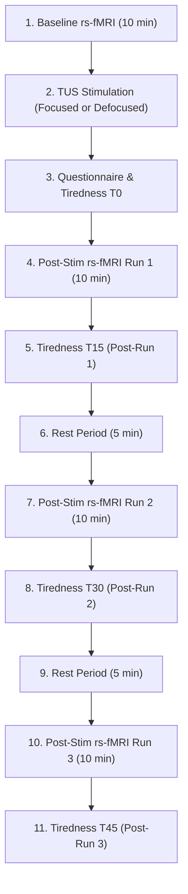
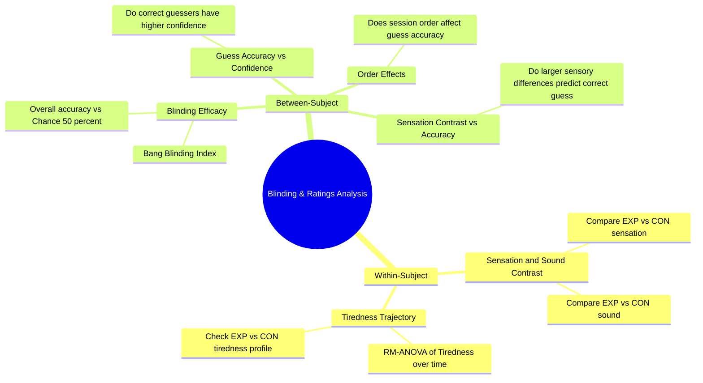

# Blinding Efficacy and Participant Ratings Analysis Protocol

This document outlines the experimental protocol, data structures, and statistical analysis plan to assess participant blinding and subjective experiences (sensation, sound, tiredness) during the CITRUS study.

---

## 1. Study Timeline and Experimental Protocol

Participants complete two separate sessions on different days—one **Experimental (focused TUS, `EXP`)** and one **Control (defocused TUS, `CON`)** in a counterbalanced order.

Each session follows this sequential timeline:

### The Role of Tiredness
The tiredness score serves as a critical control parameter. Higher levels of drowsiness or sleepiness inside the scanner introduce motion and alter resting-state functional connectivity, which can make the rs-fMRI data less reliable. Monitoring tiredness at $T_0$, $T_{15}$, $T_{30}$, and $T_{45}$ allows us to control for these confounding states.

---

## 2. Variables and Scales

All ratings and subjective scores are collected on a **1 to 5 Likert scale**:

| Variable | Min (1) | Max (5) |
| :--- | :--- | :--- |
| **Sound Level** | Barely heard it | Extremely loud |
| **Skin Sensation** | Hardly noticeable | Extremely strong |
| **Tiredness** | Not tired much / quite awake | Extremely tired / almost falling asleep |
| **Confidence Rate** | Very low confidence | Extremely high confidence |

---

## 3. Data File Structures

Data is stored in two CSV files under the `data/blinding/` directory:

### A. `sensation_sound_tiredness.csv`
Contains the sound, sensation, and tiredness scores for each subject across conditions and hemispheres.
* **Format**: 4 rows per subject (2 conditions $\times$ 2 hemispheres).
* **Columns**:
  * `Subject`: Participant ID (e.g., `sub-03`).
  * `condition`: Session condition (`EXP` or `CON`).
  * `hemisphere`: Targeted hemisphere (`L` or `R`).
  * `sound`: Subjective sound score (1-5).
  * `sensation`: Subjective physical sensation score (1-5).
  * `tired_time`: Tiredness assessment timepoint (`T0`, `T15`, `T30`, `T45`).
  * `tired_score`: Tiredness score (1-5).
  * `localite_file`, `xml_start`, `xml_end`: Technical simulation markers.

> [!NOTE]
> Since the questionnaire is administered once per session (recording L/R acoustic parameters) and tiredness is tracked continuously, the tiredness timepoints ($T_0, T_{15}, T_{30}, T_{45}$) are mapped sequentially across the rows of each subject.

### B. `forced_choice_confidence.csv`
Contains the demographics, session orders, and blinding guesses at the end of the study.
* **Columns**:
  * `subject_ID`: Participant ID (e.g., `sub-03`).
  * `age`: Age of participant.
  * `gender`: Gender (`M` or `F`).
  * `hemi_order`: Targeted hemisphere order (`RL` or `LR`).
  * `condition_order`: Real session order (e.g., `EXP-CON` means Day 1 was EXP, Day 2 was CON).
  * `forced_choice`: Participant's guess of session order (e.g., `CON-EXP`).
  * `confidence_rate`: Confidence score of their guess (1-5).

---

## 4. Statistical Analysis Plan

To fully validate blinding and characterize subjective experiences, we will perform both **within-subject** and **between-subject** comparisons.

### A. Within-Subject Analyses

#### 1. Sensation & Sound Contrast (EXP vs. CON)
* **Goal**: Determine if there are systematic differences in physical sensation or sound perception between focused (`EXP`) and defocused (`CON`) conditions.
* **Method**: 
  * Paired-sample t-tests (or Wilcoxon signed-rank tests if non-normally distributed) comparing average `sound` and `sensation` ratings between `EXP` and `CON` sessions across subjects.

#### 2. Tiredness Trajectory Over Time
* **Goal**: Model how sleepiness develops across the scanner runs, and check if it varies by condition.
* **Method**:
  * Repeated-Measures ANOVA or Linear Mixed-Effects (LME) models with factors `Time` ($T_0, T_{15}, T_{30}, T_{45}$) and `Condition` (`EXP`, `CON`).

---

### B. Between-Subject Analyses (Blinding Efficacy & Predictors)

#### 1. Blinding Efficacy (Correct Guess Rate vs. Chance)
* **Goal**: Statistically determine if participants guessed the condition order above chance level.
* **Method**:
  * Calculate **Guess Accuracy**: A guess is correct if `forced_choice` == `condition_order`.
  * Run a **Binomial Test** against a chance level of 0.50 (50%).
  * Compute **Bang's Blinding Index (BBI)** to quantify whether blinding was successful, unblinded, or opposite-direction blinded.

#### 2. Guess Accuracy vs. Confidence
* **Goal**: Assess if participants who guessed correctly were actually confident, or if they were just guessing randomly.
* **Method**:
  * Compare `confidence_rate` between **Correct Guessers** and **Incorrect Guessers** using an independent t-test or Mann-Whitney U test.
  * *Hypothesis*: If blinding was successful, confidence rates should be low and not significantly different between correct and incorrect guessers (indicating random chance guesses).

#### 3. Sensation/Sound Contrast as a Predictor of Guess Accuracy
* **Goal**: Investigate if participants who guessed correctly experienced a larger sensory "contrast" (difference) between the two days.
* **Method**:
  * For each subject, calculate:
    $$\Delta\text{Sensation} = \text{Sensation}_{\text{EXP}} - \text{Sensation}_{\text{CON}}$$
    $$\Delta\text{Sound} = \text{Sound}_{\text{EXP}} - \text{Sound}_{\text{CON}}$$
  * Compare $\Delta\text{Sensation}$ and $\Delta\text{Sound}$ between **Correct Guessers** and **Incorrect Guessers**.
  * *Hypothesis*: If unblinding is driven by physical sensations or acoustic cues, correct guessers will show significantly larger absolute differences.

#### 4. Order and Demographic Effects
* **Goal**: Check if external factors influenced blinding.
* **Method**:
  * Analyze if `condition_order` (`EXP-CON` vs. `CON-EXP`) or `hemi_order` (`RL` vs. `LR`) correlates with guess accuracy.

---

## 5. Data Visualization Plan

To visually support the analysis, we will implement the following plots:
1. **Tiredness Trajectory Plot**: A line plot showing tiredness scores at $T_0$, $T_{15}$, $T_{30}$, and $T_{45}$ with error bars, overlaid for `EXP` and `CON` sessions.
2. **Sound & Sensation Boxplots**: Side-by-side boxplots/violin plots comparing `sound` and `sensation` scores between `EXP` and `CON`.
3. **Blinding Accuracy vs. Confidence**: A bar chart or scatter plot showing individual participant guesses, color-coded by accuracy (Correct/Incorrect) and scaled by `confidence_rate`.
4. **Sensory Contrast Scatter Plot**: Plotting $\Delta\text{Sensation}$ against $\Delta\text{Sound}$ for each participant, categorized by guess accuracy.
