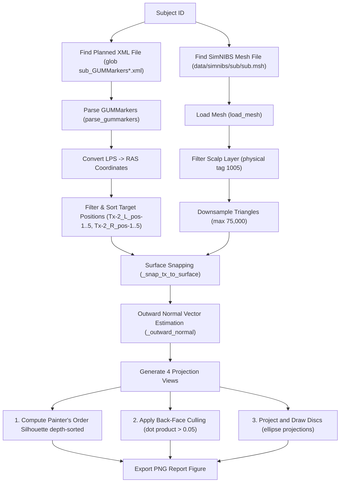

# Planned Transducer Positions Plotting Logic

@author Hoai Thu Nguyen

This document provides a comprehensive explanation of the processing, mathematical projections, and coordinate transformations implemented in [code/Tx_planned_positions.py](file:///Users/hoaithunguyen/Projects/Master%20thesis/CITRUS/code/Tx_planned_positions.py). The script generates high-resolution, multi-view figures of planned transducer locations on each subject's head model for spatial targeting verification.

---

## 1. Overview of the Figure Layout

For each subject, the script outputs a combined figure containing **4 equal panels** showing the head mesh from different camera perspectives:
1.  **Left / lateral view** (left side of head faces viewer).
2.  **Right / lateral view** (right side of head faces viewer).
3.  **Top view** (superior view looking down).
4.  **Front view** (anterior view looking face-on).

The 10 planned transducer positions (5 Left, 5 Right) are rendered as flat colored discs resting exactly on the scalp surface.

---

## 2. Processing Pipeline Workflow

---

## 3. Mathematical & Rendering Strategy

### 3.1. 2-D Orthographic Painter's Projection
Matplotlib's native 3-D library (`Poly3DCollection`) has a long-standing depth-sorting z-ordering bug. When plotting solid 3-D meshes and solid shapes together, parts of the transducer discs appear clipped or improperly layered behind the skull. 

To achieve professional quality, this script implements a **2-D orthographic projection pipeline with depth-sorted shading (Painter's Algorithm)**:
1.  The 3-D scalp mesh coordinates are projected onto a 2-D plane by dropping the camera depth coordinate depending on the selected viewport view name.
2.  The triangles are sorted back-to-front by their average depth:
    $$\text{depth}_{\text{tri}} = \frac{z_1 + z_2 + z_3}{3}$$
3.  The triangles are rendered sequentially using `matplotlib.pyplot.tripcolor` with a Greys colormap, shading the scalp relative to depth, creating a beautiful 3-D lighting illusion on a flat 2-D surface.

### 3.2. Coordinate Space Alignment (LPS to RAS)
Localite XML files often save transducer coordinates in the **LPS** (Left-Posterior-Superior) system. In contrast, NIfTI files and SimNIBS meshes use the **RAS** (Right-Anterior-Superior) system. 

To resolve this, LPS coordinates $\mathbf{x}_{\text{LPS}}$ are converted to RAS coordinates $\mathbf{x}_{\text{RAS}}$ using a diagonal flip matrix:
$$\begin{bmatrix} x_{\text{RAS}} \\ y_{\text{RAS}} \\ z_{\text{RAS}} \\ 1 \end{bmatrix} = \begin{bmatrix} -1 & 0 & 0 & 0 \\ 0 & -1 & 0 & 0 \\ 0 & 0 & 1 & 0 \\ 0 & 0 & 0 & 1 \end{bmatrix} \begin{bmatrix} x_{\text{LPS}} \\ y_{\text{LPS}} \\ z_{\text{LPS}} \\ 1 \end{bmatrix}$$

### 3.3. Surface Snapping
Due to minor coordinate-system offsets between tracking XML files and the scalp mesh boundary, placing raw XML centers onto the mesh makes the transducers float in mid-air or clip inside the skull. 

The script snaps each center $\mathbf{c}_{\text{tx}}$ to the closest mesh vertex $\mathbf{v}_{\text{snap}}$ using Euclidean distance minimization:
$$\mathbf{v}_{\text{snap}} = \arg\min_{\mathbf{v} \in \mathbf{V}_{\text{scalp}}} \|\mathbf{v} - \mathbf{c}_{\text{tx}}\|$$

### 3.4. Normal Vector and Back-Face Culling
To determine whether a transducer is facing the camera (and should be rendered) or is on the opposite side of the head (and should be hidden), the script estimates the outward surface normal $\mathbf{\hat{n}}$:
$$\mathbf{\hat{n}} = \frac{\mathbf{v}_{\text{snap}} - \mathbf{c}_{\text{mesh}}}{\|\mathbf{v}_{\text{snap}} - \mathbf{c}_{\text{mesh}}\|}$$
where $\mathbf{c}_{\text{mesh}}$ is the mesh center bounding box midpoint.

Given the unit camera direction vector $\mathbf{\hat{v}}_{\text{cam}}$:
*   The disc is **drawn** if $\mathbf{\hat{n}} \cdot \mathbf{\hat{v}}_{\text{cam}} \ge 0.05$ (facing towards the camera).
*   The disc is **culled** if $\mathbf{\hat{n}} \cdot \mathbf{\hat{v}}_{\text{cam}} < 0.05$ (hidden on the back-face of the skull).

---

## 4. Function Glossaries

### 1. `parse_gummarkers(xml_path)`
*   **Purpose:** Reads GUMMarkers XML, applies the LPS-to-RAS coordinate flip if needed, and returns the parsed list of `TxMatrix` objects.

### 2. `load_mesh(mesh_path)`
*   **Purpose:** Loads a SimNIBS `.msh` file using `meshio`, extracts the scalp triangulation boundary (GMSH physical tag 1005), and downsamples it to a maximum of 75,000 triangles for high-speed rendering.

### 3. `_snap_tx_to_surface(tx_center, mesh_points)`
*   **Purpose:** Snaps the transducer tracking coordinate to the closest scalp surface vertex.

### 4. `_outward_normal(surface_point, mesh_mid)`
*   **Purpose:** Calculates the normalized outward normal vector from the head centroid to the snapped surface point.

### 5. `_project_disc_to_2d(origin, normal, radius_mm, view_name)`
*   **Purpose:** Builds a 3-D circular ring in space centered on `origin` perpendicular to `normal`, projects it, and discards the depth axis to obtain flat ellipse coordinates on the screen.

### 6. `_mesh_silhouette_2d(points, tris, view_name)`
*   **Purpose:** Slices the 3-D mesh, projects it, and sorts the triangles back-to-front to achieve perfect depth layering.

### 7. `plot_mesh_planned_all_positions(subject, mesh_path, planned_txs, out_path)`
*   **Purpose:** Executes the pipeline for a single subject, drawing and saving the 4-view orthographic projection figures with unique, cohesive color legends.
