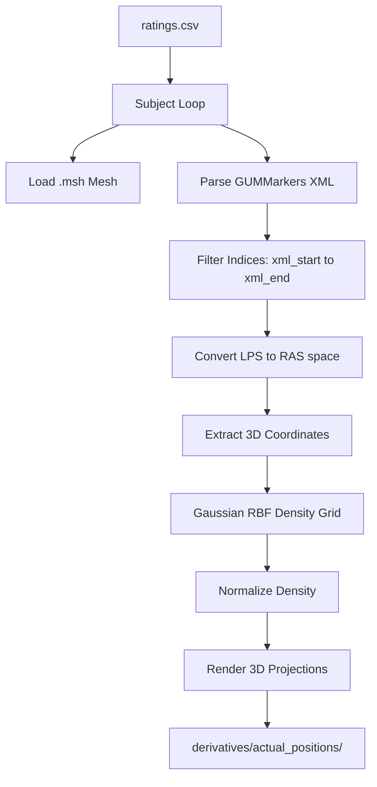

# Actual Transducer Positions Heatmap Logic

This document details the coordinate processing, density mapping algorithms, and 3D projection logic implemented in `code/Tx_actual_positions.py`.

@author Hoai Thu Nguyen

---

## 1. Pipeline Overview

The pipeline parses session recordings from Localite GUMMarkers XML files, isolates target frame segments for left and right hemispheres based on a participant ratings CSV table, computes physical density grids on the scalp mesh boundary, and projects the density as a shaded 3D heatmap in 4 orthogonal directions.

---

## 2. Coordinate System Transformations

Localite projects coordinates inside instrument tracking XMLs. Depending on setup configurations, coordinate sets are stored in either the **LPS** (Left-Posterior-Superior) or **RAS** (Right-Anterior-Superior) coordinate space. 

To align tracking systems with physical NIfTI MRI volumes, we enforce standard **RAS** space. If the tracking file uses LPS space, a diagonal flip matrix is applied to the raw transform matrices:

$$M_{\text{RAS}} = T_{\text{LPS}\to\text{RAS}} \times M_{\text{LPS}}$$

where:

$$T_{\text{LPS}\to\text{RAS}} = \begin{bmatrix} -1 & 0 & 0 & 0 \\ 0 & -1 & 0 & 0 \\ 0 & 0 & 1 & 0 \\ 0 & 0 & 0 & 1 \end{bmatrix}$$

---

## 3. Spatial Density Heatmap Calculation

To map the spatial frequency and spatial distribution of recorded transducer centers onto the subject's scalp, the script calculates a Gaussian **radial basis function (RBF)** kernel over the triangle centroids of the scalp mesh boundary:

1. **Centroid Computation**:
   For each triangle face $i$ defined by vertex coordinates $\mathbf{v}_{i,1}, \mathbf{v}_{i,2}, \mathbf{v}_{i,3}$ on the scalp boundary mesh (SimNIBS tag `1005`):
   $$\mathbf{c}_i = \frac{\mathbf{v}_{i,1} + \mathbf{v}_{i,2} + \mathbf{v}_{i,3}}{3}$$

2. **Distance Matrix Formulation**:
   For each centroid $\mathbf{c}_i$ and actual recorded transducer frame coordinate $\mathbf{x}_j$ ($j = 1 \dots N$):
   $$d_{ij} = \|\mathbf{c}_i - \mathbf{x}_j\|_2$$

3. **Gaussian Density Accumulation**:
   We evaluate density using a standard spatial kernel radius of $\sigma = 15.0\text{ mm}$:
   $$\text{density}_i = \sum_{j=1}^{N} \exp\left(-\frac{d_{ij}^2}{\sigma^2}\right)$$

4. **Min-Max Normalization**:
   To represent density uniformly across subjects and color palettes, values are normalized into the interval $[0, 1]$:
   $$\text{density}_i^{\text{norm}} = \frac{\text{density}_i - \min(\text{density})}{\max(\text{density}) - \min(\text{density}) + \epsilon}$$
   where $\epsilon = 10^{-9}$ prevents division-by-zero.

---

## 4. 3D Orthographic Mesh Rendering

Matplotlib's standard `3D` engine is used to project the triangulation faces under four standard orthogonal viewpoints:
- **Left lateral**: Elevation = $0^\circ$, Azimuth = $180^\circ$
- **Right lateral**: Elevation = $0^\circ$, Azimuth = $0^\circ$
- **Frontal**: Elevation = $0^\circ$, Azimuth = $90^\circ$
- **Top**: Elevation = $90^\circ$, Azimuth = $-90^\circ$

Faces are depth sorted using Painter's ordering (`zsort="min"`) and rendered using `Poly3DCollection` with a custom `hot` colormap and ScalarMappable legend colorbar.
