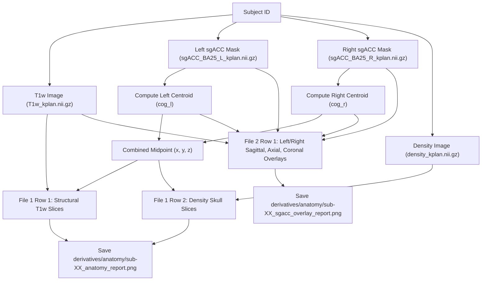

# Anatomy Report Generation Logic

@author Hoai Thu Nguyen

This document provides a comprehensive explanation of the processing logic and mathematical transformations implemented in [code/anatomy.py](file:///Users/hoaithunguyen/Projects/Master%20thesis/CITRUS/code/anatomy.py). The script generates two high-resolution structural brain report figures per subject for quality control (QC) of subgenual anterior cingulate cortex (sgACC) target localization.

---

## 1. Overview of the Output Figures

For each subject, the script writes **two separate image files** to the `derivatives/anatomy/` folder:

### 1.1. Structural Anatomy Report (`{sub}_anatomy_report.png`)
Provides a structural reference comparing structural T1w scan and segmentation density in a **2 rows × 3 columns** grid:
*   **Row 1 (T1w Only):** Raw structural T1-weighted image. Slices are centered precisely on the combined bilateral sgACC mask centroid midpoint.
    *   **Axial (z-plane)** | **Sagittal (x-plane)** | **Coronal (y-plane)**
*   **Row 2 (Density Image):** Skull segmentation density image, sliced through the same combined midpoint.
    *   **Axial (z-plane)** | **Sagittal (x-plane)** | **Coronal (y-plane)**

### 1.2. sgACC Target Localization Overlay Report (`{sub}_sgacc_overlay_report.png`)
Provides a target validation visualization showing structural overlays in a **1 row × 4 columns** grid:
*   **Column 1 (Left sagittal):** Sagittal cut through Left sgACC centroid ($x_l$), showing the Left sgACC mask overlaid in **solid yellow**.
*   **Column 2 (Right sagittal):** Sagittal cut through Right sgACC centroid ($x_r$), showing the Right sgACC mask overlaid in **solid red**.
*   **Column 3 (Axial):** Horizontal cut through combined midpoint ($z$), showing both Left (yellow) and Right (red) masks.
*   **Column 4 (Coronal):** Frontal cut through combined midpoint ($y$), showing both Left (yellow) and Right (red) masks.

---

## 2. Processing Pipeline Workflow

---

## 3. Mathematical & Logic Details

### 3.1. Centroid Computations
Voxel centers-of-mass are calculated from Left and Right binary masks and mapped to physical space:
$$\mathbf{p}_{\text{cog\_l}} = \mathbf{M} \mathbf{v}_{\text{cog\_l}}, \quad \mathbf{p}_{\text{cog\_r}} = \mathbf{M} \mathbf{v}_{\text{cog\_r}}$$
where $\mathbf{M}$ is the image affine. Slicing planes for combined views are placed at the midpoint:
$$\mathbf{p}_{\text{mid}} = \frac{\mathbf{p}_{\text{cog\_l}} + \mathbf{p}_{\text{cog\_r}}}{2}$$

### 3.2. World-to-Voxel (mm to Slice Number) Integer Mapping
To overlay coordinates as exact **slice numbers** (rather than world space float values), coordinates are mapped through the inverse affine matrix $\mathbf{M}^{-1}$ and rounded to the nearest integer:
$$\text{Slice Number} = \text{round}\left( (\mathbf{M}^{-1} \mathbf{p}_{\text{mm}})_{\text{axis}} \right)$$

### 3.3. Standard Neuroimaging Labeling Conventions
*   **Radiological orientation**: On Axial and Coronal views, anatomical left is on the viewer's right, and anatomical right is on the viewer's left.
*   **White Labels**: Solid white letters **R** (left side) and **L** (right side) are overlaid on the top corners/borders of Axial and Coronal view panels.
*   **Voxel Coordinate Labels**: Positioned in the bottom-left of each panel, showing slice index parameters as integers (e.g., `x = 174`, `y = 125`, `z = 32`).

### 3.4. Solid Color ROI Overlay Rendering
For high clarity, masks are rendered using standard Matplotlib `ListedColormap` with `alpha=1.0` and `threshold=0.1` parameters inside Nilearn's `add_overlay` API. This results in **bold, solid, non-transparent** colors (**yellow** for Left sgACC and **red** for Right sgACC).

---

## 4. Function Breakdown

### 1. `mask_centroid_mm(mask_path)`
*   **Purpose:** Extracts voxel center-of-mass from a binary NIfTI volume and converts it to physical mm scanner space.

### 2. `add_mask_overlay(display, bin_img, color, alpha)`
*   **Purpose:** Appends solid `ListedColormap` overlays with non-transparent parameters.

### 3. `make_report(sub)`
*   **Purpose:** High-efficiency structural figures builder:
    1. Computes centroids and combined midpoints.
    2. Builds the structural comparisons figure (T1w & Density) and saves to `_anatomy_report.png`.
    3. Builds the target overlay figure (1 row x 4 columns) and saves to `_sgacc_overlay_report.png`.

